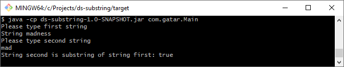

# DS Substring

## About

Simple program to evaulate if one string is a substring another. Asterisk sign `*` is a wildcard sign (means that it can
 be a match for zero or more characters). To use `*` as a standard character please escape it `\*`.

## Prerequisites

* Java 1.8
* Maven 3.6

## Running

1. Clone repository.
2. Build package: 
    ```bash
    mvn package
    ```
3. Go to `/target` and run with strings to evaluation as arguments:
    ```bash
    java -cp ds-substring-1.0-SNAPSHOT.jar com.gatar.Main string1 string2
    ```
If You run program without arguments then You can input them in the console:

